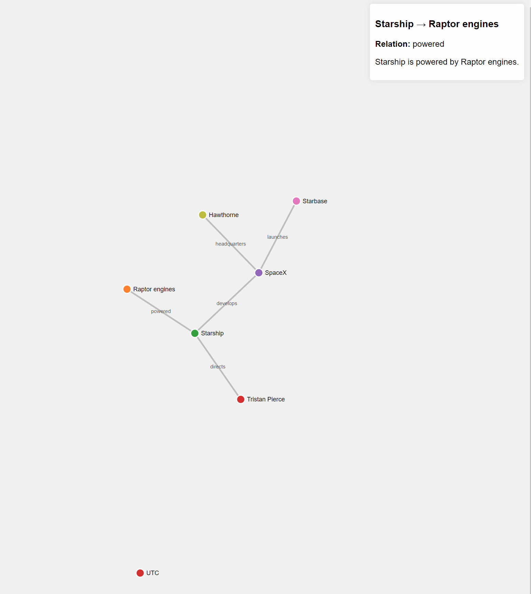

# GraphGenie: AI-Powered Graph Database Generator and Viewer



## Description
GraphGenie is an innovative tool that leverages the power of large language models to automatically generate and visualize graph databases. By extracting entities and relationships from text, GraphGenie creates a structured representation of data, making it easy to explore complex information.

## Setup Instructions

### Prerequisites
- Python 3.x
- Install required packages using `pip install -r requirements.txt`
- If using Ollama, install the `ollama-instructor` library:
  ```bash
  pip install ollama-instructor
  ```

### Configuration

- Open `main.py`.
- Set the `USE_OLLAMA` variable to `True` if you want to use the Ollama API, or `False` to use the OpenAI API.

  ```python
  USE_OLLAMA = True  # Use Ollama API
  ```

### Running the Application

1. **Run the Entity and Edge Extraction Script**

   First, execute the `main.py` script to extract entities and edges from the text and store them in the database:

   ```bash
   python main.py
   ```

   This script will read the input text from `transcript.txt`, extract entities and edges using the selected API, and store them in an SQLite database.

2. **Run the Web Application**

   After running `main.py`, start the FastAPI web application using `uvicorn`:

   ```bash
   uvicorn main_webapp:app --reload
   ```

   This will start the web server, and you can access the application in your browser at `http://127.0.0.1:8000`.

### Additional Information

- Ensure that your OpenAI API key is set in the environment variable `OPENAI_API_KEY` if using OpenAI.
- The web application provides endpoints to view the extracted entities and edges in JSON format and a root endpoint to render the homepage.

## License
Include your project's license information here.
